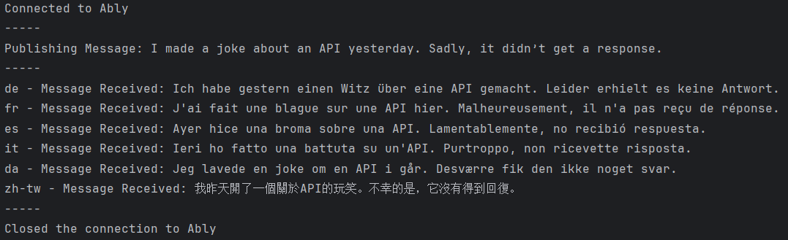

# ably_translation_demo
Very basic demo of ably pub/sub.

Make sure to replace with your own API key (https://ably.com/accounts/58866/apps/99598/getting_started).

1. A connection to Ably is made and a new channel is created.
2. A number of listeners are created each relating to a different language.
3. A message is published to the channel in English.
4. Each listener picks up the message and prints a translation.

